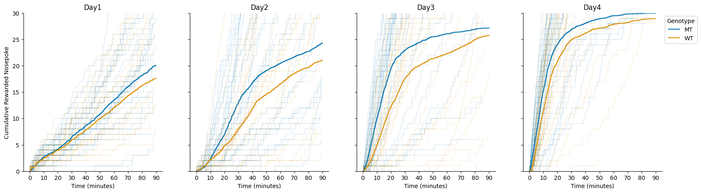

## About
This package allows you to load event files produced by Med Associates software, and eases working with the resulting data. Also includes a growing library of analysis routines.

## Install
We recommend you use anaconda virtual environments. Two main ways to install. The first, create the virtual environment, and install this package directly (more useful on "production" systems). The second, clone the repository, and then pass to anaconda the `environment.yaml` file during environment creation (more useful for development).
```
conda create -n med-assoc python=3.9
pip install git+https://github.com/tischfieldlab/med-associates-utils.git
```
OR
```
git clone https://github.com/tischfieldlab/med-associates-utils.git
cd med-associates-utils
conda create --file environment.yml
```

## Usage
Please checkout the jupyter notebooks available in the `notebooks` directory.

### Loading Data
Please see the notebook [01_Data_Loading.ipynb](notebooks/01_Data_Loading.ipynb) for a full example of data loading and manipulation basics.

To load event data from the text files produced by the med associates software, use the functions `parse_session()` or `parse_directory()` in the `med_associates_utils.session` module.
```
> from med_associates_utils.session import parse_directory
> sessions = parse_directory(r'C:\path\to\data\files\')
reading path "C:\path\to\data\files\"
100%|██████████| 30/30 [00:00<00:00, 2068.67it/s]
```
This will return to you a `SessionCollection` object, which in many ways behaves like a python list, but with some extra functionality.

We can ask the `SessionCollection` to describe itself, which will tell us the number of sessions, as well as the number of sessions containing each data scalar or array.
```
> sessions.describe()
Number of sessions: 30

Arrays present in data with counts:
(30) "A"
(30) "B"
(30) "C"
(30) "D"
(30) "F"

Scalars present in data with counts:
(30) "R"
(30) "S"
```

We can also ask the `SessionCollection` for a `pandas.DataFrame` with metadata from across the sessions.
```
> sessions.metadata
```
|     |  StartDate |    EndDate |      Subject | Experiment | Group | Box | StartTime |       StartDateTime |  EndTime | MSN |
|----:|-----------:|-----------:|-------------:|-----------:|------:|----:|----------:|--------------------:|---------:|----:|
|   0 | 2022-05-08 | 2022-05-08 | 1_EN#20_1215 |   20220508 |     1 |   4 |  07:16:07 | 2022-05-08 07:16:07 | 08:46:25 | CRF |
|   1 | 2022-05-08 | 2022-05-08 |   EN#26_1016 |   20220508 |     7 |   4 |  17:41:51 | 2022-05-08 17:41:51 | 19:11:59 | CRF |
|   2 | 2022-05-08 | 2022-05-08 |   EN#76_0924 |   20220508 |     7 |   1 |  17:41:21 | 2022-05-08 17:41:21 | 19:11:54 | CRF |
|   3 | 2022-05-08 | 2022-05-08 |   EN#77_0924 |   20220508 |     7 |   2 |  17:41:27 | 2022-05-08 17:41:27 | 19:11:56 | CRF |
|   4 | 2022-05-13 | 2022-05-13 |   EN#35_1101 |   20220513 |     8 |   2 |  12:58:24 | 2022-05-13 12:58:24 | 13:54:32 | CRF |
| ... |        ... |        ... |          ... |        ... |   ... | ... |       ... |                 ... |      ... | ... |

We can also flexibly add metadata to sessions:
```
def set_animal_id(session):
    animal_id = re.search("EN#\d+", session.metadata['Subject']).group(0)
    session.metadata['Animal'] = animal_id

sessions.apply(set_animal_id)
sessions.metadata
```
|     |  StartDate |    EndDate |      Subject | Experiment | Group | Box | StartTime |       StartDateTime |  EndTime | MSN | Animal |
|----:|-----------:|-----------:|-------------:|-----------:|------:|----:|----------:|--------------------:|---------:|----:|-------:|
|   0 | 2022-05-08 | 2022-05-08 | 1_EN#20_1215 |   20220508 |     1 |   4 |  07:16:07 | 2022-05-08 07:16:07 | 08:46:25 | CRF |  EN#20 |
|   1 | 2022-05-08 | 2022-05-08 |   EN#26_1016 |   20220508 |     7 |   4 |  17:41:51 | 2022-05-08 17:41:51 | 19:11:59 | CRF |  EN#26 |
|   2 | 2022-05-08 | 2022-05-08 |   EN#76_0924 |   20220508 |     7 |   1 |  17:41:21 | 2022-05-08 17:41:21 | 19:11:54 | CRF |  EN#76 |
|   3 | 2022-05-08 | 2022-05-08 |   EN#77_0924 |   20220508 |     7 |   2 |  17:41:27 | 2022-05-08 17:41:27 | 19:11:56 | CRF |  EN#77 |
|   4 | 2022-05-13 | 2022-05-13 |   EN#35_1101 |   20220513 |     8 |   2 |  12:58:24 | 2022-05-13 12:58:24 | 13:54:32 | CRF |  EN#35 |
| ... |        ... |        ... |          ... |        ... |   ... | ... |       ... |                 ... |      ... | ... |    ... |

(note the new column `Animal`)


We can always retrieve a dataframe with the event data across all sessions
```
event_df = sessions.to_dataframe(include_meta=['Genotype', 'Day', 'Animal', 'Subject'])
event_df
```
|     |      Subject | Genotype |  Day | Animal |                    event | time |
|----:|-------------:|---------:|-----:|-------:|-------------------------:|-----:|
|   0 | 7_EN#59-0709 |       MT | Day4 |  EN#59 | reward_retrieval_latency | 1.39 |
|   1 | 3_EN#61-0101 |       MT | Day4 |  EN#61 | reward_retrieval_latency | 1.44 |
|   2 | 6_EN#60-0823 |       WT | Day4 |  EN#60 | reward_retrieval_latency | 1.45 |
|   3 |   EN#26_1220 |       MT | Day4 |  EN#26 | reward_retrieval_latency | 1.46 |
|   4 |   EN#26_1220 |       MT | Day4 |  EN#26 | reward_retrieval_latency | 1.48 |
| ... |          ... |      ... |  ... |    ... |                      ... |  ... |


### Cumulative Event Plot
Generate a plot of cumulative events across days and by genotype using the function `med_associates_utils.viz.plot_cumulative_events()`. Please see the notebook [02_analyze_cumulative_events.ipynb](notebooks/02_analyze_cumulative_events.ipynb) for a full example.
```
from med_associates_utils.viz import plot_cumulative_events
plot_cumulative_events(event_df, col='Day', event='rewarded_nosepoke', individual='Subject', hue='Genotype')
```



### Event Raster Plot
Generate a raster plot of events over time, indicating rate via colormap, using the function `med_associates_utils.viz.plot_event_raster()`. Please see the notebook [03_analyze_event_raster_plot.ipynb](notebooks/03_analyze_event_raster_plot.ipynb) for a full example.
```
from med_associates_utils.viz import plot_event_raster
plot_event_raster(event_df)
```

